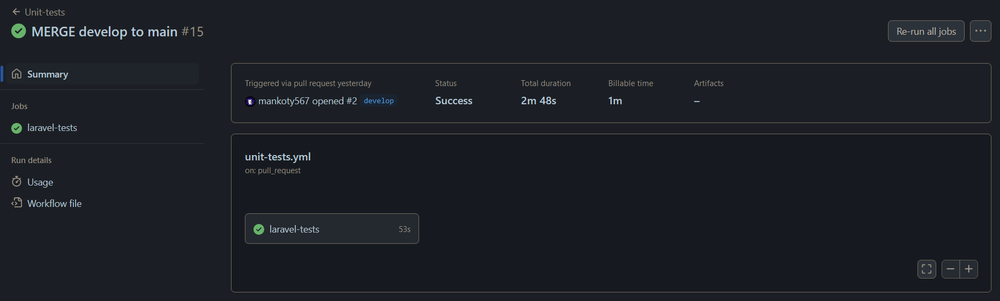
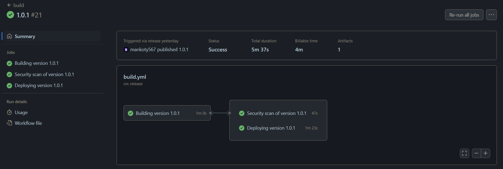
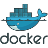

# Lostops Infrastructure

## Server Structure

The Lostops Infrastructure is composed of 3 servers:

- Backend Server
- Database Server
- Monitoring Server

The servers are VMs hosted by Azure, the DevOps team does not have the permission to create or modify the nature (flavor, image...) of the VMs.

### Backend Server

The backend server is the server where we host our Laravel web app. Besides SSH access via port 22, it should be reachable from the internet via port 80 and 443, and the connection should be restricted to HTTPS. Of course, additional port usage for Prometheus monitoring is accepted. Other than this, the server should not open other ports or install other package.

### Database Server

The database server is the server where we launch a mysql database instance with docker. Besides SSH access via port, it should be reachable only from the backend server via HTTPS. Additional port usage for Prometheus monitoring is accepted.

### Monitoring Server

The monitoring server is the server where we launch Prometheus and Grafana. Besides SSH access via port, it should be reachable from the internet via port 80 and 443, and the connection should be restricted to HTTPS.

## Tools Used

### IaC (Infrastructure as Code) Tools

#### Terraform

Used for managing VM states without having to go on Azure Portal, calls Azure APIs via azurerm.

#### Ansible

Used for executing intialization scripts once the VMs are created, functions with SSH.

### On-Server Tools

#### Prometheus

Monitoring data collection tools, functions with a main Prometheus instance and multiple Prometheus Exporters that expose metrics for the main instance to pull.

#### Grafana

Dashboard and monitoring tool, used to send alerts on message application like discord. Each metric will be humain readable, on a web interface exposed.

#### Docker

Used to manage each container, that contains applications or tools. Used to host Prometheus and Grafana server.

#### Traefik

Network management and service discovery, it serves each applications and exposes it to public addresses and domaine name.

#### MySQL (8.0)

Data storage and persistance for applications throught virtual machine reboot.

# Continuous Integration pipeline

When creating a merge request or pushing on main, all unit tests is launched to ensure that we doesn't get any regressions on this application.

The step are to setting up application on a docker container, then migrate changes and execute unit tests.

[Pipeline available here](https://github.com/lostops-stg5/lostops-app/actions/runs/8686864446)

## Build pipeline

There are three steps when creating a release version (more information [here](https://docs.github.com/en/repositories/releasing-projects-on-github/managing-releases-in-a-repository)), you need to match a number version according to :

`<Major>.<Minor>.<Revision>`

The first one is the building of docker image version, annoted by tag latest and version number (example: 1.0.0). After that, this image will be pushed inside our artifact registry, [hosted by github](https://github.com/orgs/lostops-stg5/packages/container/package/lostops-app).

The second one is the security scanning of our recently built image, that indicate how many security issues with high or critical security are present. This result is sent inside artifacts. This part is not required to be successfull, because there will be many differents security issues.

The last one take care about connecting to remote server, and updating the version of our application by using docker.

[Pipeline available here](https://github.com/lostops-stg5/lostops-app/actions/runs/8686574086)

# Tools used

 Github action : used to orchestrate every ci/cd pipelines, and automate actions.

---

 Docker : used to isolate and simplify every setup action for our application.

---

 Trivy : security scanning for docker images.

---

 Ansible : connect to remote server using SSH and do automated scripts.
